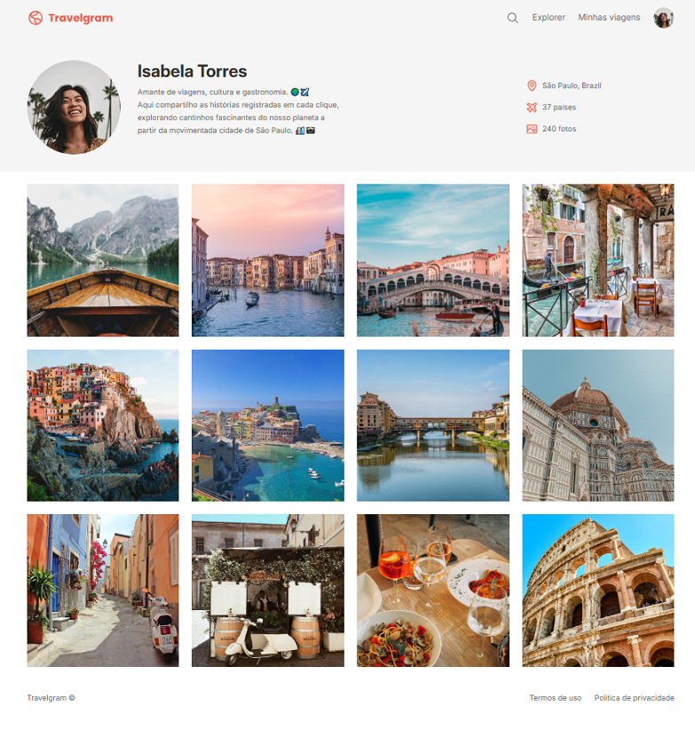

# Travelgram

É um projeto introdutório desenvolvido no curso de Full-Stack da Rocketseat.

Você pode acessar o conteúdo em:

**https://matheusorlandirocha.github.io/travelgram/**

## 🚀 Tecnologias

Esse projeto foi desenvolvido com as seguintes tecnologias:

- HTML e CSS
- Git e Github
- Figma

## 💻 Projeto

Página de perfil pessoal sobre viagens

## 🔖 Layout

Você pode visualizar o layout do projeto através [DESSE LINK](https://www.figma.com/design/joB2zl57XtqQpEW5BpKCRK/Perfil-de-viagens--Community-?node-id=0-1&p=f&t=JyaJpZEtzKKeXDlV-0). É necessário ter conta no [Figma](https://figma.com) para acessá-lo.

## :memo: Licença

Esse projeto está sob a licença MIT.

---

Feito com ♥ by Rocketseat :wave: [Participe da nossa comunidade!](https://discord.gg/rocketseat)
